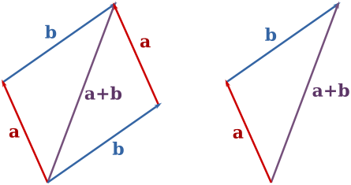

# 向量

## 向量

**向量：** 既有大小又有方向的量称为向量，记作 $\vec {a}$ 或 $\boldsymbol a$。

**有向线段：** 带方向的线段。用有向线段来直观地表示向量。起点为 $A$ 终点为 $B$ 的有向线段表示的向量，用符号简记为 $\overrightarrow{AB}$.

**向量的模：**向量的大小（或长度），用 $|\overrightarrow{AB}|$ 或 $|\boldsymbol{a}|$ 表示。

**零向量**：模为 $0$ 的向量。零向量的方向任意。记为：$\vec 0$ 或 $\boldsymbol{0}$。

**单位向量**：模为 $1$ 的向量称为该方向上的单位向量。

**平行向量**：方向相同或相反的两个 **非零** 向量。规定 $\vec 0$ 与任意向量平行。$\boldsymbol{a}$ 与 $\boldsymbol{b}$ 平行，记作：$\boldsymbol{a}\parallel \boldsymbol{b}$ 。

**共线向量：**与平行向量的定义相同。任一组平行向量都可以平移到同一直线上。

**向量的夹角**：已知两个非零向量 $\boldsymbol a,\boldsymbol b$，作 $\overrightarrow{OA}=\boldsymbol a,\overrightarrow{OB}=\boldsymbol b$，那么 $\theta=\angle AOB$ 就是向量 $\boldsymbol a$ 与向量 $\boldsymbol b$ 的夹角。记作：$\langle \boldsymbol a,\boldsymbol b\rangle$。当 $\theta=\frac{\pi}{2}$ 时，称这两个向量垂直，记作 $\boldsymbol a\perp \boldsymbol b$。规定 $\theta \in [0,\pi]$。

## 向量的线性运算

### 向量的加法



#### 向量加法的三角形法则

对于平面上的任意两个向量 $\boldsymbol{a}$ 和 $\boldsymbol{b}$，在平面内任取一点 $A$，作 $\overrightarrow{AB}=\boldsymbol{a}$，$\overrightarrow{BC}=\boldsymbol{b}$，作向量 $\overrightarrow{AC}$.

称向量 $\overrightarrow{AC}$ 为向量 $\boldsymbol{a}$ 和 $\boldsymbol{b}$ 的 **和向量**，$\overrightarrow{AB}+\overrightarrow{BC}=\overrightarrow{AC}.$


如图1，把向量首尾顺次相连，向量的和为第一个向量的起点指向最后一个向量的终点；

#### 向量加法的平行四边形法则

若要求和的两个向量 **共起点**，那么它们的和向量为以这两个向量为邻边的平行四边形的对角线，起点为两个向量共有的起点，方向沿平行四边形对角线方向。

#### 向量的减法

减法可以写成加上相反数的形式，即：$a-b=a+(-b)$，如图1，$b=c-a$，$a=c-b$.

#### 向量的数乘

给定一个实数 $\lambda$ 和一个向量 $\boldsymbol a$，规定其乘积为一个向量，记作 $\lambda \boldsymbol a$，其模与方向定义如下：

1. $|\lambda \boldsymbol a|=|\lambda| |\boldsymbol a|$；
2. 当 $\lambda >0$ 时，$\lambda\boldsymbol a$ 与 $\boldsymbol a$ 同向，当 $\lambda =0$ 时，$\lambda \boldsymbol a=\boldsymbol 0$，当 $\lambda<0$ 时，$\lambda \boldsymbol a$ 与 $\boldsymbol a$ 方向相反。

这种运算是向量的数乘运算。

#### 坐标表示

$$
\boldsymbol a + \boldsymbol b=(\boldsymbol a_x+\boldsymbol b_x,\;\boldsymbol a_y+\boldsymbol b_y)\\
\boldsymbol a - \boldsymbol b=(\boldsymbol a_x-\boldsymbol b_x,\;\boldsymbol a_y-\boldsymbol b_y)\\
\lambda \boldsymbol a=(\lambda\boldsymbol a_x,\;\lambda\boldsymbol a_y)
$$

## 向量的数量积

已知两个向量 $\boldsymbol a,\boldsymbol b$，它们的夹角为 $\theta$，那么：
$$
\boldsymbol a \cdot \boldsymbol b=|\boldsymbol a||\boldsymbol b|\cos \theta=\boldsymbol a_x\boldsymbol b_x+\boldsymbol a_y\boldsymbol b_y
$$
就是这两个向量的 **数量积**，也叫 **点积** 或 **内积**。其中称 $|\boldsymbol a|\cos \theta$ 为 $\boldsymbol a$ 在 $\boldsymbol b$ 方向上的投影。数量积的几何意义即为：数量积 $\boldsymbol a \cdot \boldsymbol b$ 等于 $\boldsymbol a$ 的模与 $\boldsymbol b$ 在 $\boldsymbol a$ 方向上的投影的乘积。

这种运算得到的结果是一个实数，为标量。

可以方便的计算出 $\cos \theta$，于是有如下应用：

1. $\boldsymbol a \perp \boldsymbol b$ $\iff$ $\boldsymbol a\cdot \boldsymbol b=0$

2. $\boldsymbol a = \lambda \boldsymbol b$ $\iff$ $|\boldsymbol a\cdot \boldsymbol b|=|\boldsymbol a||\boldsymbol b|$

3. $|\boldsymbol a|=\sqrt {m^2+n^2}$
4. $\cos \theta=\cfrac{\boldsymbol a\cdot\boldsymbol b}{|\boldsymbol a||\boldsymbol b|}$

## 向量的向量积

给定两个向量 $\boldsymbol a,\boldsymbol b$，规定其向量积为一个向量，记作 $\boldsymbol a\times \boldsymbol b$，其模与方向定义如下：

1. $|\boldsymbol a\times \boldsymbol b|=|\boldsymbol a||\boldsymbol b|\sin \langle \boldsymbol a,\boldsymbol b\rangle$；

2. $\boldsymbol a\times \boldsymbol b$ 与 $\boldsymbol a,\boldsymbol b$ 都垂直，且 $\boldsymbol a,\boldsymbol b,\boldsymbol a\times \boldsymbol b$ 符合右手法则。

向量积也叫外积，其几何意义是：**$|\boldsymbol a\times \boldsymbol b|$ 是以 $\boldsymbol a,\boldsymbol b$ 为邻边的平行四边形的面积**。

向量积与 $\boldsymbol a,\boldsymbol b$ 所在平面垂直，其竖坐标为 $\boldsymbol a_x\boldsymbol b_y-\boldsymbol a_y\boldsymbol b_x$.

我们根据右手法则可以推断出 $\boldsymbol b$ 相对于 $\boldsymbol a$ 的方向，逆时针方向竖坐标为正值，反之为负值。

## 坐标旋转公式

若将向量 $\boldsymbol a=(x,\;y)$ 逆时针旋转 $\alpha$，得到向量 $\boldsymbol b$，则有：
$$
\boldsymbol b=(x\cos \alpha-y\sin \alpha,\;y\cos \alpha+x\sin\alpha)
$$
可以通过三角恒等变换证明。

## 参考代码

```cpp
const double eps = 1e-10;
inline int fcmp(double x, double y) {
	if(fabs(x - y) < eps) return 0;
	else return x > y ? 1 : -1;
}
struct Point{
	double x, y;
	Point(){};
	Point(double a, double b): x(a), y(b) {}
	Point(Point a, Point b): x(b.x - a.x), y(b.y - a.y) {}
	Point operator + (const Point &b) {
		return Point(x + b.x, y + b.y);
	}
	Point operator - (const Point &b) {
		return Point(x - b.x, y - b.y);
	}
	double operator * (const Point &b) {
		return x * b.y - y * b.x;
	}
	double operator & (const Point &b) {
		return x * b.x + y * b.y;
	}
	bool operator == (const Point &b) {
		return fcmp(x, b.x) == 0 && fcmp(y, b.y) == 0;
	}
	double len() {
		return sqrt(x * x + y * y);
	}
};
typedef Point Vec;
inline double dis(Point &a, Point &b) {
	return (a - b).len();
}
inline double angle(Point &a, Point &b) {
	return acos((a & b) / a.len() / b.len());
}
inline Vec rotate(Vec &a, double k) {
	return Vec(a.x * cos(k) - a.y * sin(k), a.x * sin(k) - a.y * cos(k));
}
```

# 平面凸包

## 相关概念

**凸多边形：**所有内角大小都在 $[0,\pi]$ 范围内的 **简单多边形**。


**平面凸包：**平面上的一个子集 $S$ 被称为凸的，当且仅当对于任意两点 $p, q\in S$，线段 $\overline{pq}$ 都完全属于 $S$.集合 $S$ 的凸包 $\mathcal{CH}(S)$，是包含 $S$ 的最小凸集，也就是包含 $S$ 的所有凸集的交。


如上图，凸包还可以理解为平面上有若干柱子，**用橡皮筋套住所有柱子**，绷紧后形成的多边形即为凸包。

所以有更友好的定义（不一定准确）。

**凸包：**在平面上能包含所有给定点的最小凸多边形叫做凸包。

## 暴力求解

用二维坐标 $(x_i, y_i)$ 的形式给定点集 $P$，考虑如何暴力求解。


注意到，若线段 $\overline{pq}$ 在凸包上，则 $P$ 中的点均位于直线 $pq$ 的同一侧。若我们钦定 $p\rightarrow q$ 按顺时针方向，则有更强的限制，需要 $P$ 中的点都在直线的右侧。

于是可以枚举有序点对 $(p, q)\in P\times P$，若 $P$ 中的点都在有向线段 $\overline{pq}$ 的右侧，则 $\overline{pq}$ 是 $\mathcal{CH}(P)$ 中的一条边。

需要用到向量的叉积，点 $t$ 在 $\overrightarrow {pq}$ 右侧 $\Longleftrightarrow$ $\overrightarrow{pt}\times \overrightarrow{pq}>0$.

这样的复杂度是 $\mathcal{O}(n^3)$ 的，有很多可以优化的地方。

## Andrew算法

Andrew 算法是一种递增式算法，流程如下。

> 递增式算法 (incremental algorithm)，在计算几何中常见。算法思想：逐一加入 $P$ 中的点，每增加一个点，都更新一次目前的解，加入最后一个点后，即可得到答案。

首先把所有点 **排序** ，以横坐标为第一关键字，纵坐标为第二关键字。

排序后，第一个点和末尾的点，一定在凸包上，容易通过反证法证明。

从左往右看，上下凸壳斜率的 **单调性相反**，即所旋转的方向不同，所以要分开求。

我们 **升序枚举** 求出下凸壳，然后 **降序枚举** 求出上凸壳，这样凸包的每条边都是向 **逆时针方向** 旋转的。

设当前枚举到点 $P$，即将把其加入凸包；当前栈顶的点为 $S_1$，栈中第二个点为 $S_2$.

求凸包时，若 $P$ 与 $S_1$ 构成的新线段是顺时针旋转的，即叉积满足：$\overrightarrow{S_2S_1}\times \overrightarrow{S_1P}<0$，则弹出栈顶，继续检查，直到 $\overrightarrow{S_2S_1}\times \overrightarrow{S_1P}\ge 0$ 或者栈内仅剩一个元素为止。


上图是一个弹栈的例子，$p_i$ 是新加入的点，细线是加入 $p_i$ 之前的凸包状态。

记 $n=|P|$，则时间复杂度为 $\mathcal{O}(n\log n)$，瓶颈在排序部分。


如上图，若将弹出栈顶元素的条件改为 $\overrightarrow{S_2S_1}\times \overrightarrow{S_1P}\leq 0$，同时停止条件改为 $\overrightarrow{S_2S_1}\times \overrightarrow{S_1P}> 0$，则求出的凸包中不存在三点共线。可视情况更改。

## Graham算法

Andrew 算法是 Graham 算法的改进版本。在 Graham 算法中，点集按照极角序排序。

**极角：**任取一个顶点 $O$ 作为极点，作射线 $OX$，称为极轴。平面上一点 $p$ 的极角，即为向量 $\overrightarrow{Op}$ 与极轴 $OX$ 的夹角。一般地，取 $x$ 轴作为极轴，以逆时针方向为正。

可以利用 `atan2(double y, double x)` 进行极角排序。函数返回值为 $(x, y)$ 与 $x$ 轴的极角，数值 $\in(-\pi, \pi]$.

```cpp
bool cmp(Point a, Point b) {
    if(atan2(a.y, a.x) - atan2(b.y, b.x) == 0)
        return a.x < b.x;
    return atan2(a.y, a.x) < atan2(b.y, b.x);
}
```

另外一种方式是利用叉积排序。

```cpp
bool cmp(Point a, Point b) {
    return a * b > 0;                       
}
```

注意极角排序时，无论用 `atan2` 还是叉积，精度上都会出现不少问题，尽量避免使用这种方法。

## 动态凸包（CF70D）

维护一个点集 $S$ 的凸包，需要支持如下操作：

- 询问点 $p$ 是否在当前的凸包中，
- 向 $S$ 中添加点 $p$，

保证坐标均为整数。

### 分析

和 Andrew 算法一样，这里的算法按照坐标字典序排序。相对于极角排序，能够减小精度误差。

用两个 `std::map<int, int>`，用 $\operatorname{top}$ 记录上凸包，$\operatorname{down}$ 记录下凸包。

**存储方法：**若上凸包中存在横坐标为 $x$ 的点，则这个点的纵坐标为 $\operatorname{top}[x]$，$\operatorname{down}$ 同理。

### 询问操作

只需满足：**在上凸包之下**且**在下凸包之上**。


以上凸包为例。$i$ 在上凸包之下，当且仅当 $|\overrightarrow{ik}\times \overrightarrow{ij}|\geq 0$.

```cpp
bool check_top(int x, int y) { //是否在上凸包下面
	auto k = top.lower_bound(x);
	if(k == top.end())
		return false;
	if(k -> first == x)
		return y <= k->second;
	if(k == top.begin()) return false;
	auto j = k; j--;
	return Point(k->first - x, k->second - y) *
		   Point(j->first - x, j->second - y) >= 0;
}
```

下凸包同理，$i$ 在下凸包之上，当且仅当 $|\overrightarrow{ik}\times \overrightarrow{ij}|\leq 0$

```cpp
bool check_down(int x, int y) { //是否在下凸包上面
	auto k = down.lower_bound(x);
	if(k == down.end())
		return false;
	if(k -> first == x)
		return y >= k->second;
	if(k == down.begin()) return false;
	auto j = k; j--;
	return Point(k->first - x, k->second - y) *
		   Point(j->first - x, j->second - y) <= 0;
}
```

### 插入操作

### 插入操作

把 $p$ 点加入凸包，上下凸包都要尝试。把加入 $p$ 点后，删掉不满足凸性的点。


如上图，这些点一定是分布在 $p_x$ 左右的连续段。

因此找到 $p$ 点在上/下凸壳中的位置，向左右分别删点，直到满足凸性。

注意迭代器的边界问题。如果已经删没了，要及时退出循环，否则会 RE。

```cpp
void insert_top(int x, int y) {
	if(check_top(x, y)) return;
	top[x] = y;
	auto it = top.find(x);
	auto jt = it;
	if(it != top.begin()) { //remove left
		jt--;
		while(remove_top(jt++)) jt--;
	}
	if(++jt != top.end()) { //remove right
		while(remove_top(jt--)) jt++;
	}
}
void insert_down(int x, int y) {
	if(check_down(x, y)) return;
	down[x] = y;
	auto it = down.find(x);
	auto jt = it;
	if(it != down.begin()) { //remove left
		jt--;
		while(remove_down(jt++)) jt--;
	}
	if(++jt != down.end()) { //remove right
		while(remove_down(jt--)) jt++;
	}
}
```

下面的函数用于：判断能否删除当前点，若能删，则执行删除操作。

```cpp
bool remove_top(map<int, int>::iterator it) {
	if(it == top.begin()) return false; //到边界就不删了
	if(++it == top.end()) return false; it--;
	auto jt = it, kt = it;
	jt--; kt++;
	if(Point(it -> first - jt -> first, it->second - jt->second) *
	   Point(it -> first - kt -> first, it->second - kt->second) <= 0) {
		   top.erase(it);
		   return true;
	}
	return false;
}
bool remove_down(map<int, int>::iterator it) {
	if(it == down.begin()) return false;
	if(++it == down.end()) return false; it--;
	auto jt = it, kt = it;
	--jt; ++kt;
	if(Point(it -> first - jt -> first, it->second - jt->second) *
	   Point(it -> first - kt -> first, it->second - kt->second) >= 0) {
		   down.erase(it);
		   return true;
	}
	return false;
}
```

# 三维凸包

## 三维向量类


**存储：**用结构体记录三维坐标，方便重载运算符。

```cpp
struct Point3 {
	double x, y, z;
	Point3(){};
	Point3(double a, double b, double c) : x(a), y(b), z(c) {}
}
```

**加法、减法和点乘**：与二维向量类似。

```cpp
Point3 operator + (const Point3 &b) {
    return Point3(x + b.x, y + b.y, z + b.z);
}
Point3 operator - (const Point3 &b) {
    return Point3(x - b.x, y - b.y, z - b.z);
}
double operator & (const Point3 &b) {
    return x * b.x + y * b.y + z * b.z;
}
```

**叉乘：**$\vec a\times \vec b$ 的结果为一个三维向量 $\vec c$，$\vec c\perp \vec a$ 且 $\vec c\perp \vec b$，结果向量的模长为 $|\vec a||\vec b|\sin \langle \vec a,\vec b\rangle$，代表以 $\vec a$、$\vec b$ 为两边的平行四边形的面积。


在三维向量体系中，我们需要用坐标表示结果向量 $\boldsymbol{a}$，推导过程如下。（来源：[叉积 - 维基百科](https://zh.wikipedia.org/wiki/%E5%8F%89%E7%A7%AF)）

右手坐标系中，基向量 $\boldsymbol{i},\boldsymbol{j},\boldsymbol{k}$ 满足以下等式：
$$
\begin{array}{c}
\boldsymbol{i}\times\boldsymbol{j} = \boldsymbol{k}\\
\boldsymbol{j\times i} = -\boldsymbol{k}\\
\boldsymbol{j}\times\boldsymbol{k} = \boldsymbol{i}\\
\boldsymbol{k\times j} = -\boldsymbol{i}\\
\boldsymbol{k}\times\boldsymbol{i} = \boldsymbol{j}\\
\boldsymbol{i\times k} = -\boldsymbol{j}
\end{array}
$$
根据外积的定义可以得出：$\boldsymbol{i}\times\boldsymbol{i} = \boldsymbol{j}\times\boldsymbol{j} = \boldsymbol{k}\times\boldsymbol{k} = \boldsymbol{0}$.

根据以上等式，结合外积的**分配律**，就可以确定任意向量的外积。

任取向量 $\boldsymbol{u}=u_1\boldsymbol{i} + u_2\boldsymbol{j} + u_3\boldsymbol{k} $ 和 $\boldsymbol{v}=v_1\boldsymbol{i} + v_2\boldsymbol{j} + v_3\boldsymbol{k}$，两者的外积 $\boldsymbol{u} \times \boldsymbol{v}$ 可以根据分配率展开：
$$
\begin{align}
\boldsymbol{u}\times\boldsymbol{v} = &(u_1\boldsymbol{i} + u_2\boldsymbol{j} + u_3\boldsymbol{k}) \times (v_1\boldsymbol{i} + v_2\boldsymbol{j} + v_3\boldsymbol{k})\\
= &u_1v_1(\boldsymbol{i} \times \boldsymbol{i}) + u_1v_2(\boldsymbol{i} \times \boldsymbol{j}) + u_1v_3(\boldsymbol{i} \times \boldsymbol{k}) + \\
&u_2v_1(\boldsymbol{j} \times \boldsymbol{i}) + u_2v_2(\boldsymbol{j} \times \boldsymbol{j}) + u_2v_3(\boldsymbol{j} \times \boldsymbol{k}) + \\
&u_3v_1(\boldsymbol{k} \times \boldsymbol{i}) + u_3v_2(\boldsymbol{k} \times \boldsymbol{j}) + u_3v_3(\boldsymbol{k} \times \boldsymbol{k})\\
\end{align}
$$
把前面的 $6$ 个等式代入，则有：
$$
\begin{align}
 \boldsymbol{u}\times\boldsymbol{v} = {} &- u_1v_1\boldsymbol{0} + u_1v_2\boldsymbol{k} - u_1v_3\boldsymbol{j} \\
                                 &- u_2v_1\boldsymbol{k} - u_2v_2\boldsymbol{0} + u_2v_3\boldsymbol{i} \\
                                 &+ u_3v_1\boldsymbol{j} - u_3v_2\boldsymbol{i} - u_3v_3\boldsymbol{0} \\
                            = {} &(u_2v_3 - u_3v_2)\boldsymbol{i} + (u_3v_1 - u_1v_3)\boldsymbol{j} + (u_1v_2 - u_2v_1)\boldsymbol{k}\\
\end{align}
$$
因此结果向量 $\boldsymbol{s} = \boldsymbol{u} \times \boldsymbol{v} = s_1\boldsymbol{i} + s_2\boldsymbol{j} + s_3\boldsymbol{k}$ 的三维坐标为：
$$
\begin{align}
  s_1 &= u_2v_3-u_3v_2\\
  s_2 &= u_3v_1-u_1v_3\\
  s_3 &= u_1v_2-u_2v_1
\end{align}
$$

```cpp
Point3 operator * (const Point3 &b) {
    return Point3(y*b.z - z*b.y, z*b.x - x*b.z, x*b.y - y*b.x);
}
```

## 三维凸包及性质

由 $n$ 个点构成的凸多面体。

**性质：**根据欧拉公式，任意包含 $n$ 个顶点的凸多面体，所含的边不会超过 $3n-6$ 条，所含的小平面不会超过 $2n-4$ 张。

## 随机增量法

